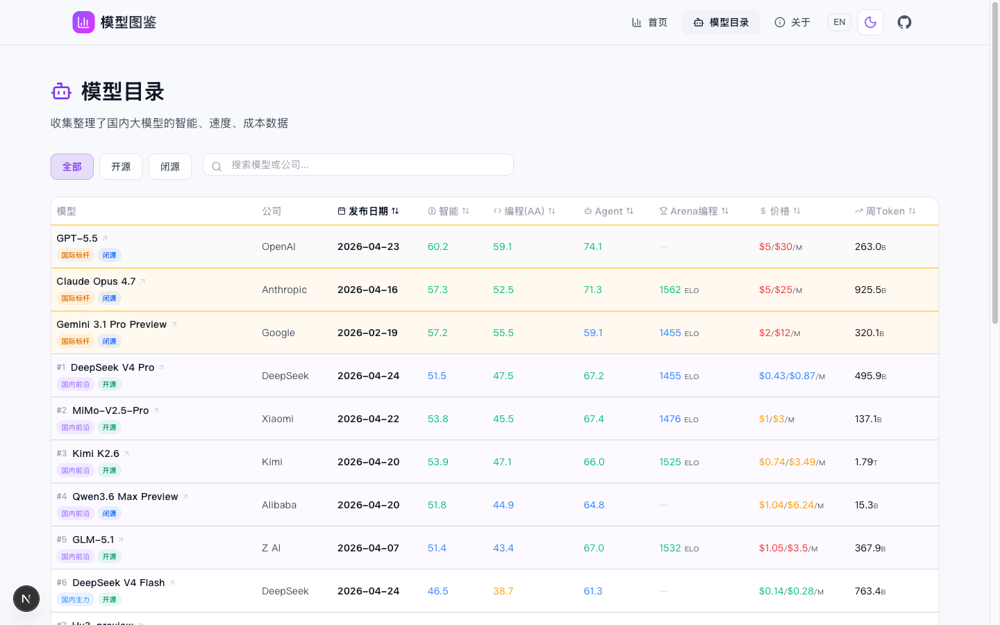

# 模型图鉴

国内大模型数据，整理在一起。

[在线浏览](https://www.llmcompare.cc) · [GitHub](https://github.com/citrusli2026/llmcompare)





## 关于项目

模型图鉴是一个开源数据项目，收集和整理国内各大语言模型的公开数据，包括：

- **智能评分** — 综合 MMLU、HumanEval、MATH 等基准测试（来源：Artificial Analysis）
- **编程能力** — Artificial Analysis 编程专项评分
- **Agent 能力** — Artificial Analysis Agent 专项评分
- **Arena 排名** — lmarena.ai 编程/视觉排行榜 ELO 分数
- **Arena 投票** — lmarena.ai 人类评测投票数（反映模型受欢迎程度）
- **官方定价** — 各厂商标准 API 定价 + OpenRouter 市场行情定价

国际模型（来自非国内厂商）作为对比标杆与国内模型统一排序，标注 `isInternational` 标志（来源：`flags.chinese_eval` 为 false）。所有模型在 `/models` 页面通过同一张可排序表格展示。

数据每日自动刷新（详见 `data/pipeline.py`）。

## 数据管线

```
../data/1-fetch/    → 抓取 Artificial Analysis / OpenRouter / Arena
../data/3-process/  → 4 步处理管线：筛国内 → 构建前端模型 → 富化+切活跃 → 生成报告
../data/4-final/    → ranking.json (活跃) + ranking_all.json (全量)
../app/src/data/    → 同步 ranking.json 给前端消费
```

完整流程由 `../data/pipeline.py` 一键编排（分支准备 → 抓取 → 处理 → 同步 → 验证 → 提交 PR → 清理），日常无需手工跑各步骤。

- **data_complete**: 富化时计算，需 `intelligence + coding + agentic + speed + pricing` 五维度齐全；缺一即 `false`
- **Arena votes**: 作为热度指标注入；OpenRouter pricing/tokens 仍由管线消费
- **验证脚本**: `scripts/validate-data.py` + Vitest/Build/Lint 在 `pipeline.py` Phase 5 一起跑

## 本地运行

```bash
npm install && npm run dev
```

## 技术栈

Next.js 16 (App Router) · React 19 · TypeScript · Tailwind CSS v4 · shadcn/ui · Vitest · Playwright

支持暗色/亮色主题切换、中英文双语。

## 测试

```bash
npm test              # 单元测试 + 集成测试 (Vitest)
npm run test:e2e      # E2E 测试 (Playwright)
npm run build         # 构建 + 静态导出验证
python3 scripts/validate-data.py  # 数据质量验证
```

## 贡献

修正或补充模型信息 → [提交 Issue](https://github.com/citrusli2026/llmcompare/issues)

## License

MIT
