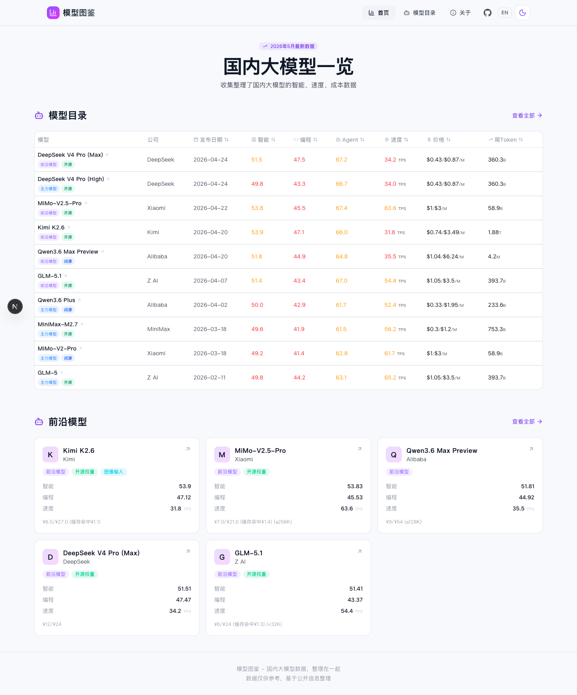
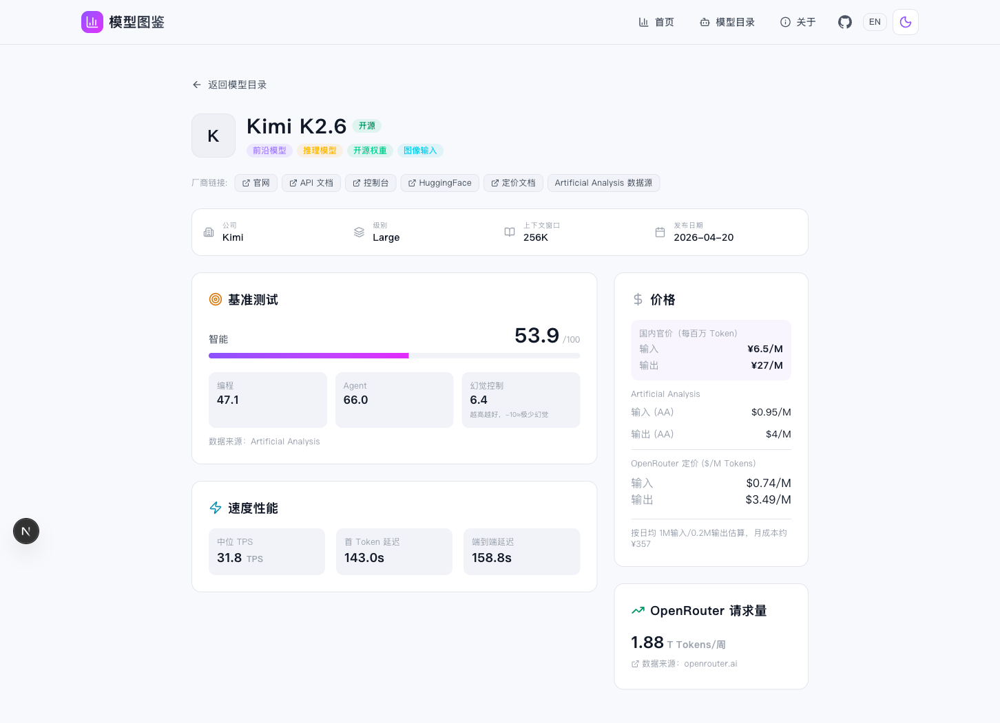

# 模型图鉴

国内大模型数据，整理在一起。

[在线浏览](https://llmcompare.cc) · [GitHub](https://github.com/citrusli2026/llmcompare)





## 关于项目

模型图鉴是一个开源数据项目，收集和整理国内各大语言模型的公开数据，包括：

- **智能评分** — 综合 MMLU、HumanEval、MATH 等基准测试（来源：Artificial Analysis）
- **API 速度** — 中位输出速度 (TPS)、首 Token 延迟
- **官方定价** — 各厂商标准 API 定价 + OpenRouter 市场行情定价
- **Token 消耗** — 周度 API 调用量排名（来源：OpenRouter）

目前收录约 30 个国内活跃大模型，数据每周更新。

## 本地运行

```bash
npm install && npm run dev
```

## 技术栈

Next.js 16 (App Router) · React 19 · TypeScript · Tailwind CSS v4 · shadcn/ui

支持暗色/亮色主题切换、中英文双语。

## 贡献

修正或补充模型信息 → [提交 Issue](https://github.com/citrusli2026/llmcompare/issues)

## License

MIT
